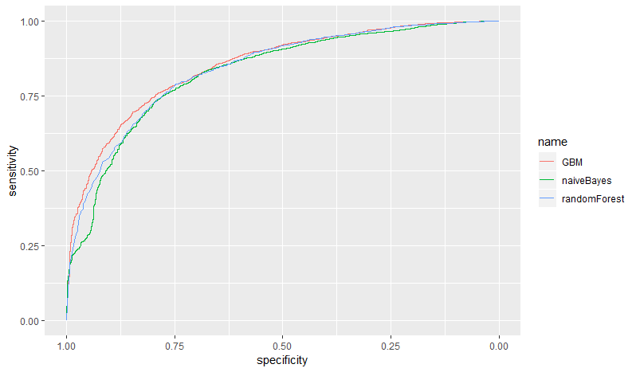
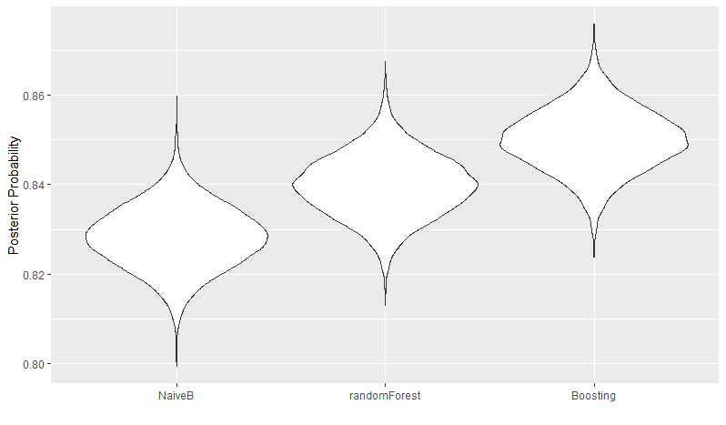
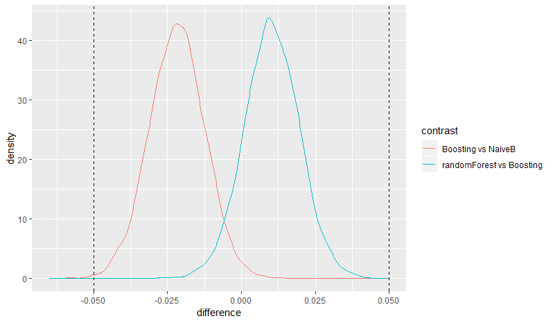

## Outline

* Models

* Bayesian Model

* McMc Simulation

* Model Selection


# Models

## Models used

* Generalized Boosted Modeling (GBM), Classification And Regression Tree (CART), Naive Bayes (NB)


ROC Curves for all three models




# Model Selection

## Bayesian linear regression

* get all cross-validations from models

* estimate the relationship between outcome metric, as measured by our model (in our case AUC) and the joint variance of the cross validation steps.

* We run a simple linear regression using a 5000 cycle Markov Chain Monte Carlo simulation to find the distribution of our cross-validation measured metric

* Estimate the difference between models

## Distribution of all Model Metrics (ROC)



## Difference between Models

We have about 1700 people that left, so assuming that a 5% churn rate a year makes a difference, we need to base our model selection on those 5% making a difference

```{r, echo=FALSE}
library(readr)
dif <- suppressMessages(read_csv("helper/dif_table.csv"))
knitr::kable(dif)
```

## Visualizing the difference



## Deciding on the winner

From our statistics, there is no practical difference between the three models, so we would choose the model with fastest performance, in this case, it is the GBM model, which also happens to have highest AUC score.

I would then use the model to create a custom cutoff rate that would allow us to even better predict those customers that are likely to leave and sacrifice those that are stayers. Reaching out to people that would have stayed makes for a better impression while also reaching to more people that are likely to leave.